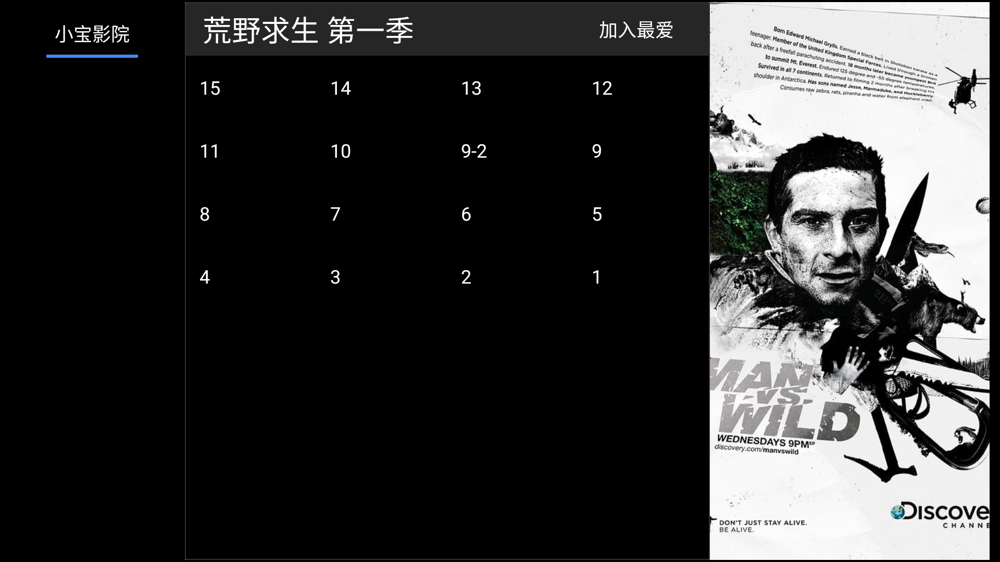
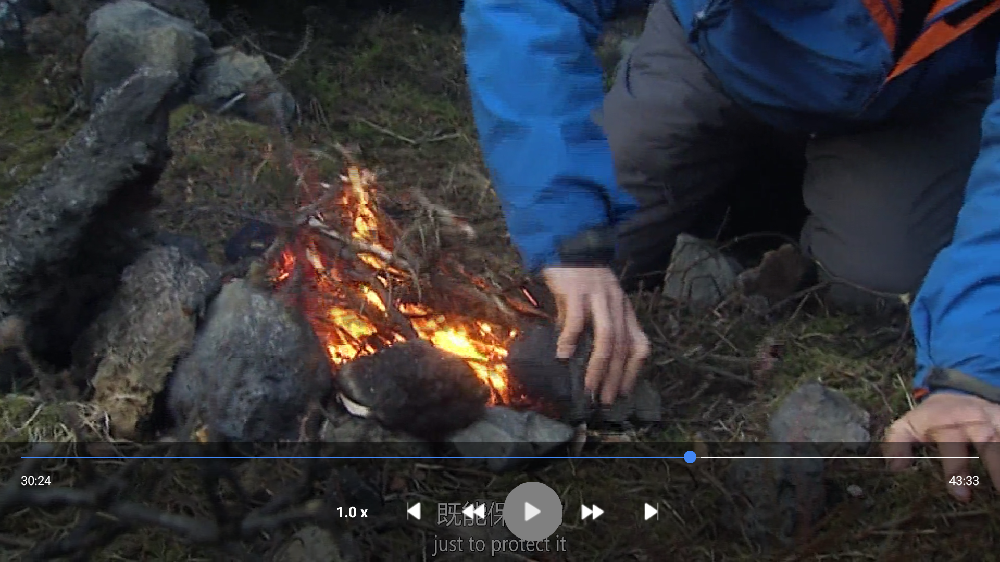

# RNTV

<p align="center">
    <picture >
      
    </picture>    
</p>

## What is RNTV?

RNTV is a video streaming tv/mobile application. Stream video from your sources.

## Table of Contents

- [What is RNTV?](#what-is-rntv)
- [Table of Contents](#table-of-contents)
- [Screenshots](#screenshots)
- [Installation](#installation)
- [Development](#development)
- [Add your video sources](#add-your-video-sources)
- [Release build](#release-build)
- [License](#license)

## Screenshots

<p align="center">
    
    
    
    
</p>

## Installation

Make sure you have setup react native environment [here](https://reactnative.dev/docs/environment-setup)

Clone this repo

```bash
git clone https://github.com/dev6699/rntv.git
cd rntv
```

Install dependencies

```bash
yarn
```

## Development

```
yarn android
```

### Add your video sources

- Sample source can be found at [/src/services/tv/sample.ts](/src/services/tv/sample.ts)

1. Add your source satisfy the following types.

   ```typescript
   export type TVideoProvider = {
     getHomeVideoList(): Promise<TVideosRec[]>;
     getVideoCategory(path: string): Promise<TVideosRec[]>;
     getVideoCategoryList(path: string): Promise<TVideosRec[]>;
     getVideoSources(path: string): Promise<TVideoSources>;
     getVideoUrl(path: string): Promise<string>;
     getVideoSearchResult(keyword: string): Promise<TVideo[]>;
     updateVideoStatus(video: TVideo): Promise<TVideo>;
   };
   ```

2. Include the source in [/src/services/tv/index.ts](/src/services/tv/index.ts)

   ```typescript
   import { TVideoProvider } from './types';
   import * as sample from './sample';

   export * from './types';

   export const TVService: Record<string, TVideoProvider> = {
     sample,
   } as const;
   ```

## Release build

Find output apk at [/android/app/build/outputs/apk/release/app-release.apk](/android/app/build/outputs/apk/release/app-release.apk)

```
yarn build
```

## License

[](https://github.com/dev6699/rntv/blob/main/LICENSE)

This project is licensed under the terms of the [MIT license](/LICENSE).
