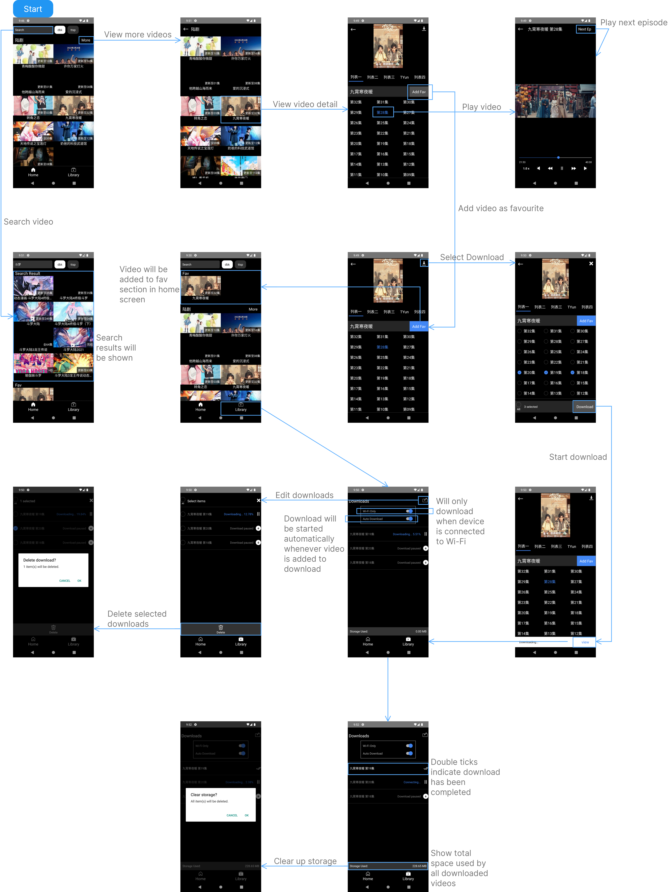

# RNTV

<p align="center">
    <picture >
      
    </picture>    
</p>

## What is RNTV?

RNTV is a video streaming application. Stream video from your sources.

#### Platform Support

| Android | Web | Linux | Windows | MacOS | IOS |
| :-----: | :-: | :---: | :-----: | :---: | :-: |
|   ✅    | ✅  |  ✅   |   ✅    |   ✅  |  ❓ |

## Table of Contents

- [What is RNTV?](#what-is-rntv)
- [Table of Contents](#table-of-contents)
- [Flow](#flow)
- [Main Features](#main-features)
- [Installation](#installation)
- [Development](#development)
- [Add your video sources](#add-your-video-sources)
- [Release build](#release-build)
- [License](#license)

## Flow

Made with _[Lunacy](https://icons8.com/lunacy)_



## Main Features

- Built in web browser for downloading videos from websites 📥
- HLS Streaming 🌐
- Video Download with AES-128 Encrypted Stream Support 🔒
- Android TV Remote Control Support 📺
- Internationalization: English and Chinese 🌍
- Save Favorite Videos ❤️
- Simple and Clean UI with No Ads 📱

## Installation

Make sure you have setup react native environment [here](https://reactnative.dev/docs/environment-setup)

Clone this repo

```bash
git clone https://github.com/dev6699/rntv.git
cd rntv
```

Install dependencies

```bash
yarn
```

## Development

**NOTE:**
To build your project for TV, you should change your package.json imports to import react-native as follows, so that this package is used instead of the core react-native package. [More information](https://github.com/react-native-tvos/react-native-tvos?tab=readme-ov-file#react-native-tvos)
```
"react-native": "npm:react-native-tvos@<version>"
```

1. For android
   ```
   yarn start
   ```
2. For web,
   ```
   yarn web
   ```
   Open your web browser and go to http://localhost:19006 to access the application.

### Add your video sources

- Sample source can be found at [/src/services/tv/sample.ts](/src/services/tv/sample.ts)

1. Add your source satisfy the following [types](/src/services/tv/types.ts).

   ```typescript
   export type TVideoProvider = {
     /**
      * Called when application first boot up, showing videos in home screen
      */
     getHomeVideoList(): Promise<TVideosRec[]>;

     /**
      * Called when `more` button is clicked on home screen
      * @param path url to the video category
      */
     getVideoCategory(path: string): Promise<TVideosRec[]>;

      /**
      * Called when reached the end of category screen
      * @param path url to the video category list
      * @param page next page to load
      */
      getVideoCategoryMore(path: string, page: number): Promise<TVideosRec>

     /**
      * Called when video card is clicked
      * @param path url to the video
      */
     getVideoSources(path: string): Promise<TVideoSources>;

     /**
      * Called when video episode is clicked
      * @param path url to find the playable video url (e.g. mp4, m3u8...)
      */
     getVideoUrl(path: string): Promise<string>;

     /**
      * Called when video search is performed
      * @param keyword video search keyword
      */
     getVideoSearchResult(keyword: string): Promise<TVideo[]>;

     /**
      * Called when favourite videos are loaded from local storage
      * to ensure videos status are up to date
      * @param video favourite video stored in local
      */
     updateVideoStatus(video: TVideo): Promise<TVideo>;
   };
   ```

2. Include the source in [/src/services/tv/index.ts](/src/services/tv/index.ts)

   ```typescript
   import { TVideoProvider } from './types';
   import * as sample from './sample';

   export * from './types';

   export const TVService: Record<string, TVideoProvider> = {
     sample,
   } as const;
   ```

## Release build

1. For android, find `app-release.apk` at [/android/app/build/outputs/apk/release](/android/app/build/outputs/apk/release)

   ```
   yarn build
   ```

2. For desktop, find output at [/desktop/out/rntv-desktop-linux-x64/rntv-desktop](/desktop/out/rntv-desktop-linux-x64/rntv-desktop)

   For more information on how the output may vary depending on your environment, please refer to https://www.electronforge.io/cli.

   ```
   yarn build:desktop
   ```

## License

[](https://github.com/dev6699/rntv/blob/main/LICENSE)

This project is licensed under the terms of the [MIT license](/LICENSE).
